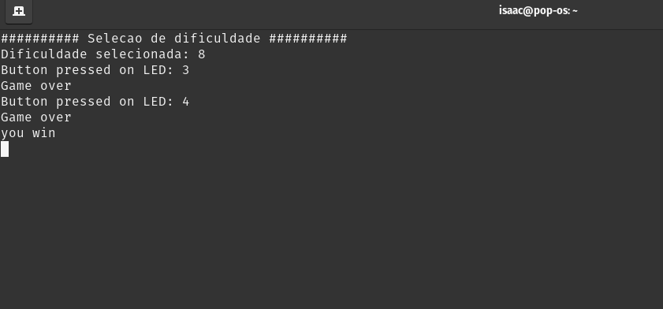

# **Roleta de LEDs**

## Jogo desenvolvido em bare-metal utilizando a linguagem C, para a placa de desenvolvimento Beaglebone Black (BBB)

---

## **Ferramentas utilizadas:**

* Beaglebone Black

* Cabo TTL, cabo de rede, leds, jumpers, resistores, push button e protoboard.

* Sistema operacional Linux + minicom

### **Descrição:**

O objetivo do jogo é tentar acertar o LED central, evitando os demais LEDs. Foi implementado dois botões, onde um botão serve para o usuário selecionar o nível de dificuldade, e o outro para confirmar o nível, iniciar o jogo e seleciar um dos LEDs.

### **Finalidade:**

Este projeto desenvolvido na disciplina de Técnicas de Programação para Sistemas Embarcados I (TPSE-I), consiste em aplicar todos os conhecimentos aprendido em aula, como a configuração e utilização de GPIOs, Interrupções, Timers, em sistemas embarcados.

## Registros do Funcionamento do jogo

 **Jogando** |  **Interface**
 ---               | ---
  | 

 ---

### By: [Isaac Vinícius]https://(www.linkedin.com/in/isaacvinicius), [Hugo Bessa](https://linkedin.com/in/hugo-santos-da-costa-bessa-0287951b0), [Gislan Souza](https://www.linkedin.com/in/gislan-souza-silva-772b74236).
